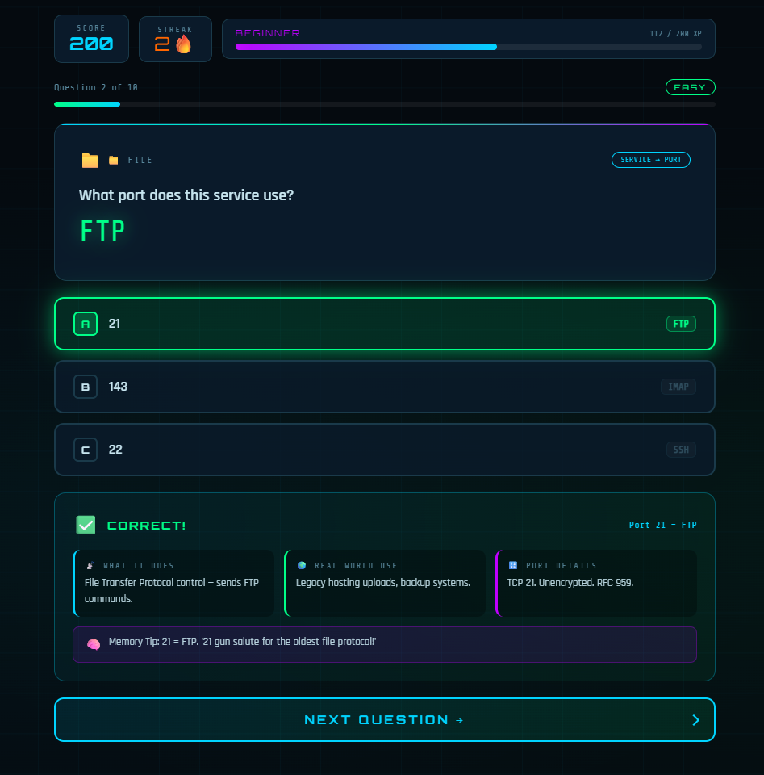

# 🌐 NetPortQuiz

> An interactive quiz game to help you memorize the 100 most important network ports.
>
> 

I built this for myself while studying for networking — flashcards were boring, so I made something actually fun. Figured others might find it useful too.

---

## 🎮 Play it here

👉 **[aezakm1s.github.io/NetPortQuiz](https://aezakm1s.github.io/NetPortQuiz/)**

Or download `index.html` and open it in your browser — works completely **offline**, no server needed.

---

## ✨ Features

- 🎯 3 answer choices per question — only one is correct
- 💡 Instant feedback with explanations after each answer
- 📊 Score tracking, streaks, and accuracy percentage
- ⚡ 3 difficulty levels: Easy, Medium, Hard
- 🖤 Cyberpunk-style dark UI with smooth animations
- 🔌 100 ports covered across web, email, database, security, and file transfer

---

## 🔌 Ports covered

`FTP` `SSH` `Telnet` `SMTP` `DNS` `DHCP` `HTTP` `POP3` `IMAP` `HTTPS` `RDP` `MySQL` `PostgreSQL` `MongoDB` `Redis` `LDAP` `SMB` `SNMP` `NTP` `BGP` and ~80 more.

---

## 🛠️ Built with

- Vanilla HTML, CSS, JavaScript — no frameworks, no dependencies
- AI-assisted development using [Claude](https://claude.ai)

---

## 💭 Why I made this

Studying network ports is tedious. I wanted something that keeps you engaged, explains *why* each port matters, and tracks what you keep getting wrong.

This is that thing.
